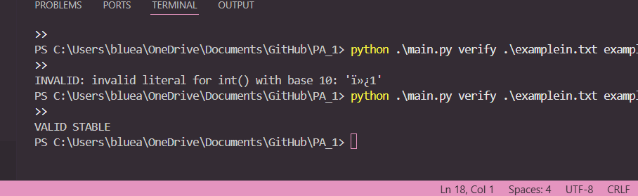
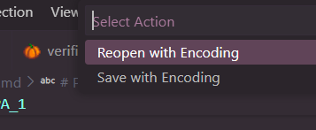
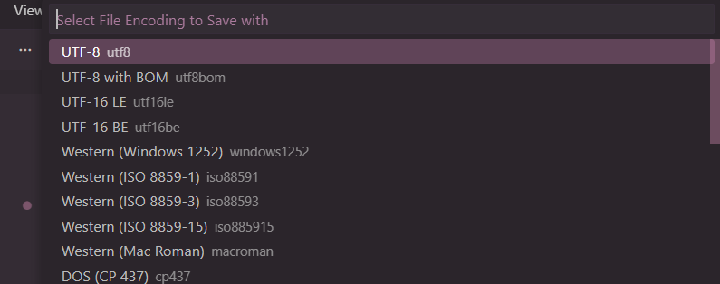
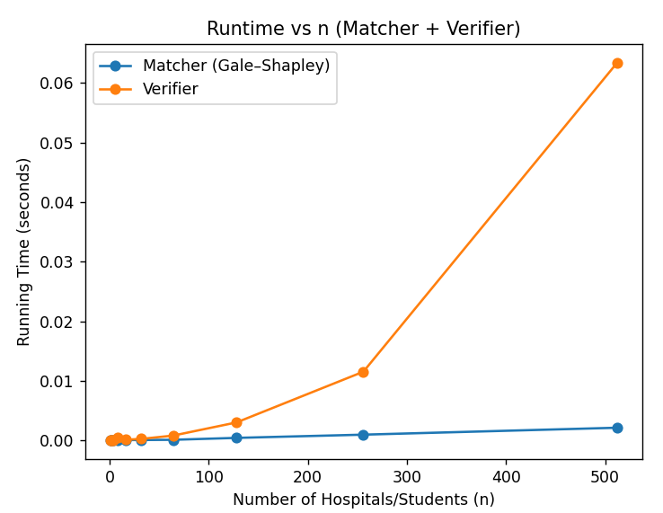

# PA_1

### FILES
`gale_shapley:` <br/>

Takes a collection of hospital objects, each with a preference list of students and produces a matching that is guaranteed to be stable with respect to hospital preferences.

`read_input:` <br/>

Handles input parsing and object creation and ensures the matcher and verifier receive correctly structured data.

`verifier:` <br/>

Checks validity, stability, and confirms that matching is not only complete, but also stable.

`runningTime:` <br/>

Measures running time of the Gale-Shapley matcher and verifier. Plots running time vs `n` for matcher and verifier on the same graph and demonstrates that both algorithms scale approximately `O(n²)`.


`main.py:` <br/>

Acts as the controller for the entire program and connects Tasks A, B, and C together.

<br>

### TESTING | ERROR MAY OCCUR WITH OUTPUT TEXT FILE, SOLUTION BELOW
<ol>
<br>
<li>
After creating outpit file "exampleout.txt", go to bottom right corner of the exampleout.txt file and click on UTF-##

<div align="center">
<br>
      
    </div>     
</li>

<br>
<li>
Select Save with enconding

<div align="center">
<br>
      
    </div> 
    </li>

<br>
<li>
Select UTF-8 (!!NOT BOM!!)

<div align="center">
<br>
      
    </div> 
    </li>
    <br>
<li>    
Run verfier again
</li>
</ol>
<br>

### COMMANDS
<br/>

`Paste these into your terminal`
1. input: 
```
python .\main.py match .\examplein.txt
```
2. output: 
```
python .\main.py match .\examplein.txt | Out-File -Encoding utf8 exampleout.txt
```
3. verifier (after changing to UFT-8): 
```
python .\main.py verify .\examplein.txt exampleout.txt
```
4. graph:

<br/>

`To install matplotlib`

```
pip install matplotlib
```
`After installing matplotlib`
```
python .\runningTime.py
```
<br>

### GRAPH
<br/>

Matcher grows roughly like `O(n²)` because each hospital can propose to each student at most once `(≤ n² proposals)`.

Verifier also grows roughly like `O(n²)` because it checks preference rankings across pairs/builds ranking maps.

On the graph, both curves increase slowly at first and then rise faster as n gets large `(especially 256 → 512)`. 

<br>
<div align="center">
<br>
      
    </div> 
    </li>
    <br>

<br>

Assumptions:
We assume there will always be an equal number of hospitals and students. 
We assume that each hospital's list of preferences will include ONE of each of the applicants. 
No duplicates and no missing values. We assume the same for the preferences of the applicants. 
We also assume that the input file is made up of integers. 

Helen Dang: 58380926<br/>
Carmel Norris: 99049562
